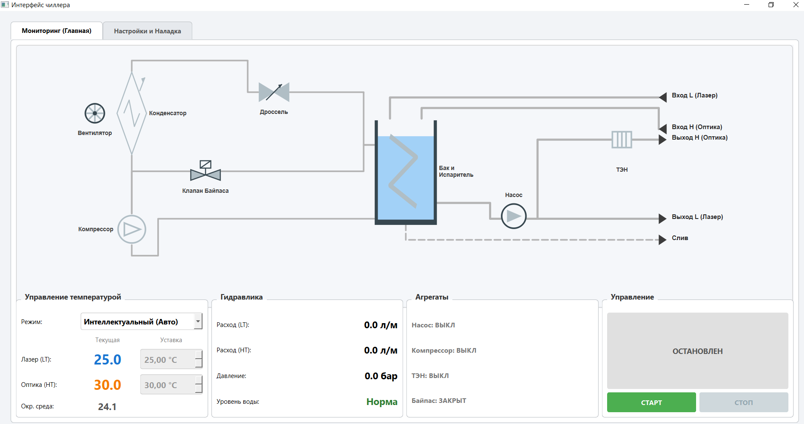
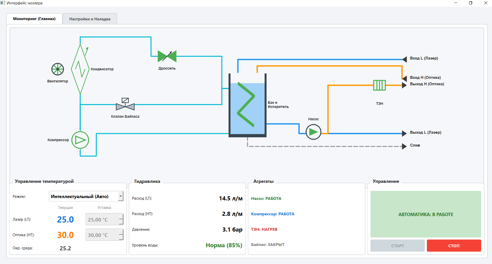
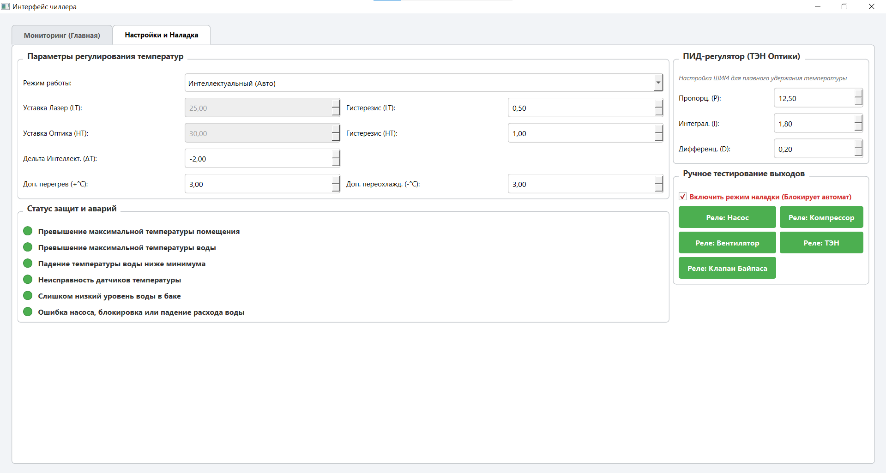
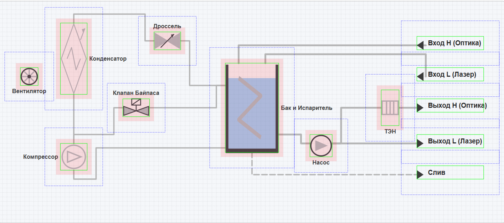
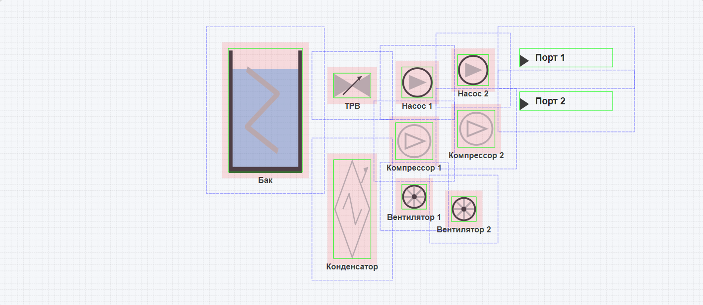
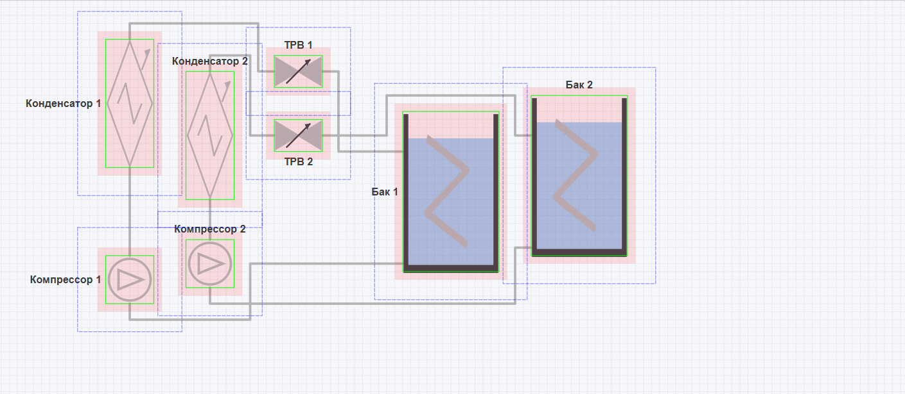

# laser-cooler-control

## Скриншоты интерфейса

Главный экран

Главный экран с имитацией работы

Вкладка Настройки и Наладки

Схемы с отрисованной сеткой и bounding box
1. Светло-серая сетка, показывающая шаг узлов 10x10, по которым ходит A*.
2. Зеленые рамки вокруг оборудования (базовые физические координаты отрисовки).
3. Синие пунктирные рамки с отступом padding=35, которые TopologyLayoutEngine использует для раздвигания компонентов.
4. Красные полупрозрачные зоны с отступом padding=10, которые A* пометил для себя как infinity (препятствия, сквозь которые прокладывать трубу категорически нельзя).

